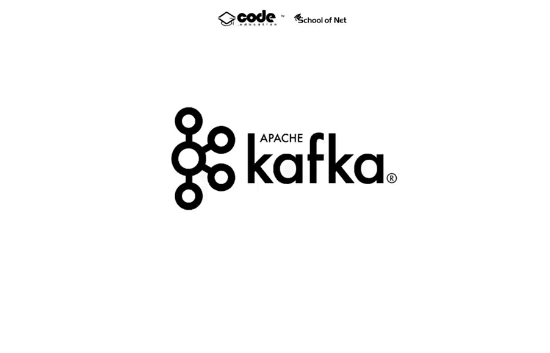
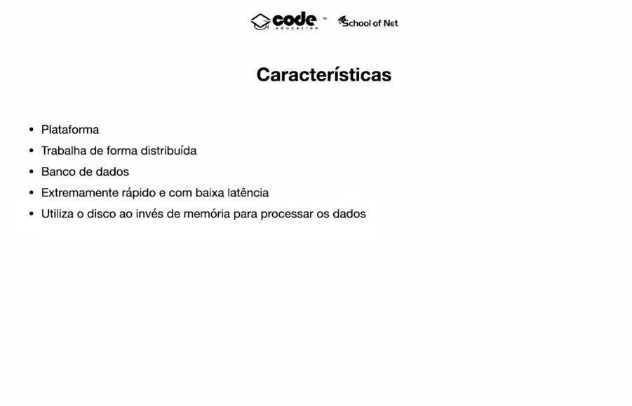
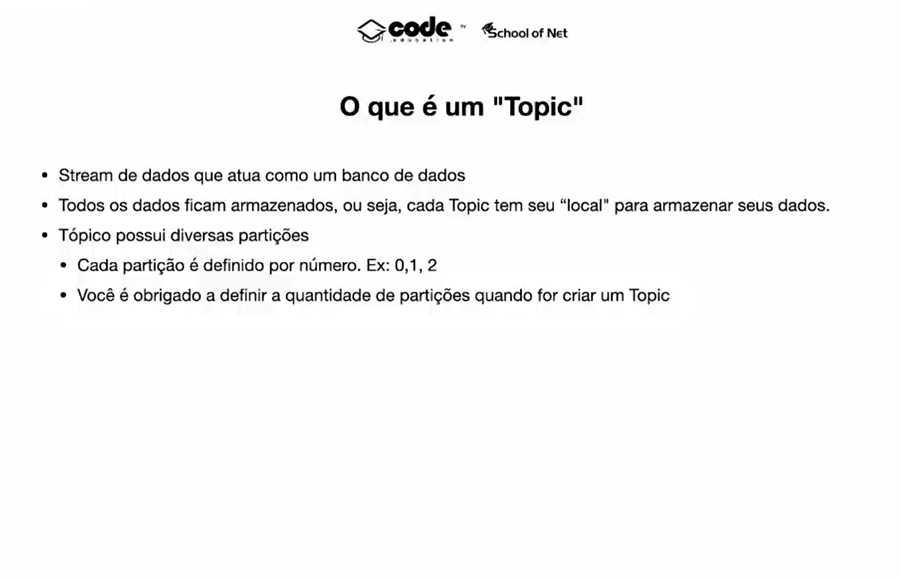
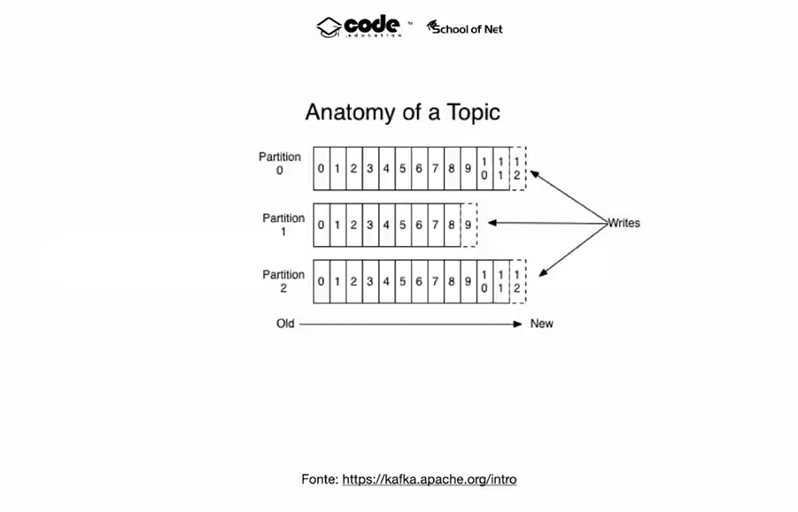
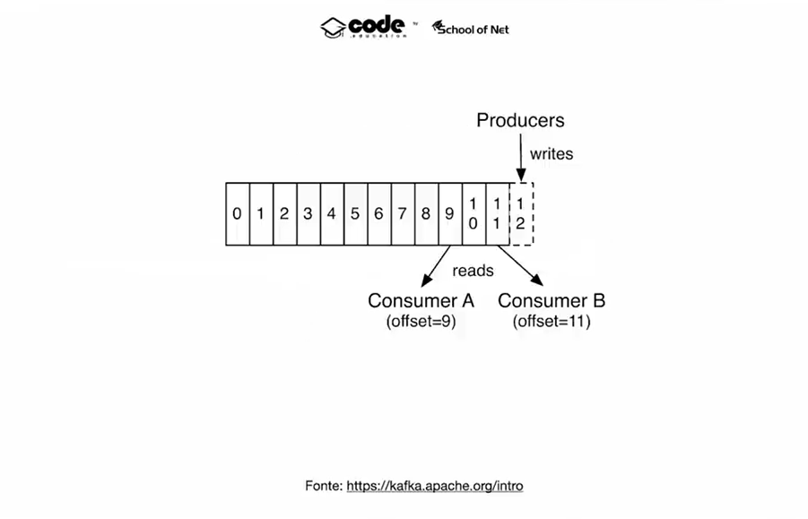
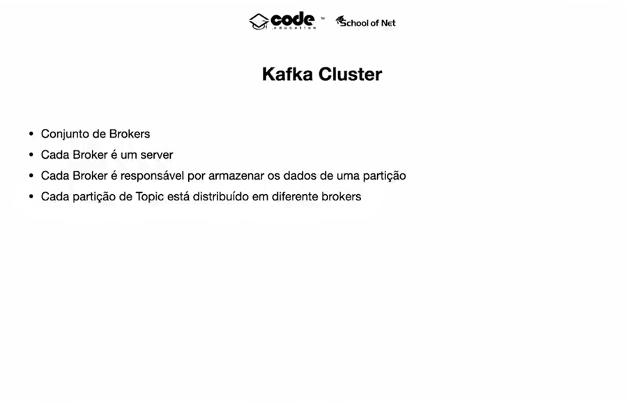
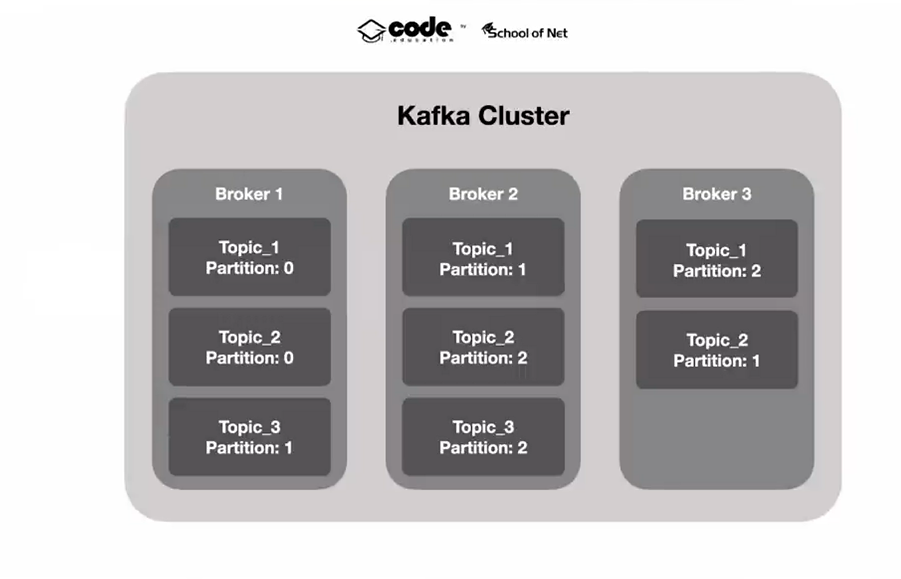
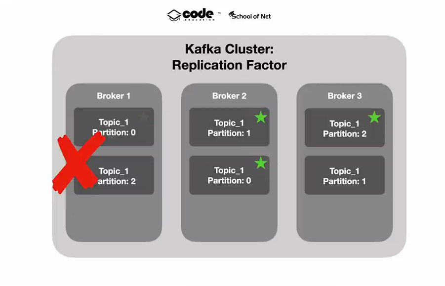
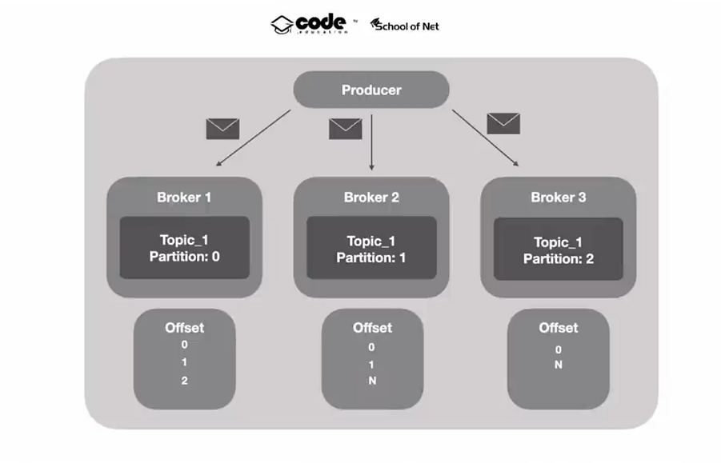
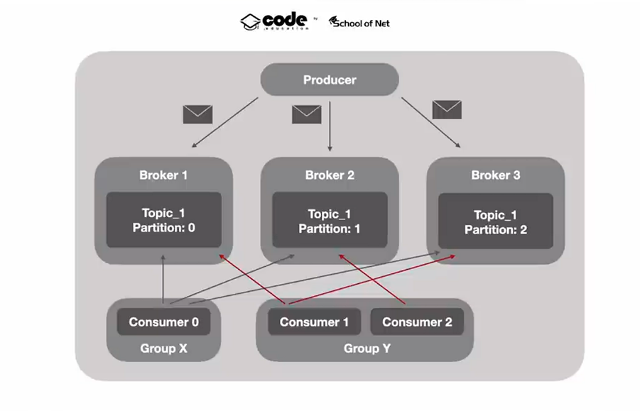

# 2. Integrando Microsserviços ao Apache Kafka

> Movido a eventos

> Tempo real / Histórico dos dados

> Não é apenas um sistema tradicional de filas como RabbitMQ.

> Cada mensagem cai em um offset dentro de uma partition

> Producer - Quem gera o dado | Consumer - Quem consume o dado

> Kafka Cluster

1. Criar Web Server - Disponibilizar end points do microserviço
2. Colocar em ação todos os UseCases - Qdo receber um event do Kafka

