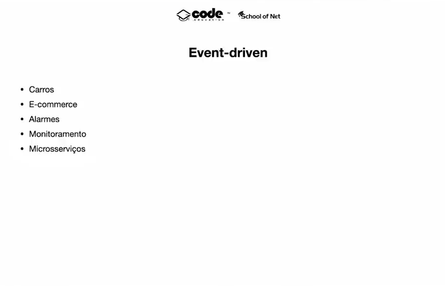

# 2. Integrando Microsserviços ao Apache Kafka


> Movido a eventos



> Tempo real / Histórico dos dados


> Não é apenas um sistema tradicional de filas como RabbitMQ.


> Cada mensagem cai em um offset dentro de uma partition


> Producer - Quem gera o dado | Consumer - Quem consume o dado


> Kafka Cluster


1. Criar Web Server - Disponibilizar end points do microserviço
2. Colocar em ação todos os UseCases - Qdo receber um event do Kafka


**Banco de dados**

1. Criar Tabelas
2. Inserir dados

> File: 

```go
package main

import (
	"context"
	"database/sql"
	"net/http"

	"github.com/sialka/cartola_fc/internal/infra/db"
	"github.com/sialka/cartola_fc/internal/infra/repository"

	httphandler "github.com/sialka/cartola_fc/internal/infra/http"

	//"github.com/sialka/cartola_fc/internal/infra/kafka/consumer"

	"github.com/go-chi/chi"
	"github.com/sialka/cartola_fc/pkg/uow"

	_ "github.com/go-sql-driver/mysql"
)

func main() {
	ctx := context.Background()
	dtb, err := sql.Open("mysql", "root:root@tcp(localhost:3306)/cartola?parseTime=true")
	if err != nil {
		panic(err)
	}
	defer dtb.Close()
	uow, err := uow.NewUow(ctx, dtb)
	if err != nil {
		panic(err)
	}
	registerRepositories(uow)

	r := chi.NewRouter()

	r.Get("/players", httphandler.ListPlayersHandler(ctx, *db.New(dtb)))
	r.Get("/my-teams/{teamID}/players", httphandler.ListMyTeamPlayersHandler(ctx, *db.New(dtb)))
	r.Get("/my-teams/{teamID}/balance", httphandler.GetMyTeamBalanceHandler(ctx, *db.New(dtb)))
	r.Get("/matches", httphandler.ListMatchesHandler(ctx, repository.NewMatchRepository(dtb)))
	r.Get("/matches/{matchID}", httphandler.ListMatchByIDHandler(ctx, repository.NewMatchRepository(dtb)))

	if err = http.ListenAndServe(":8081", r); err != nil {
		panic(err)
	}

}

// Registrando todos os infra/repository
func registerRepositories(uow *uow.Uow) {
	uow.Register("PlayerRepository", func(tx *sql.Tx) interface{} {
		repo := repository.NewPlayerRepository(uow.Db)
		repo.Queries = db.New(tx)
		return repo
	})

	uow.Register("MatchRepository", func(tx *sql.Tx) interface{} {
		repo := repository.NewMatchRepository(uow.Db)
		repo.Queries = db.New(tx)
		return repo
	})

	uow.Register("TeamRepository", func(tx *sql.Tx) interface{} {
		repo := repository.NewTeamRepository(uow.Db)
		repo.Queries = db.New(tx)
		return repo
	})

	uow.Register("MyTeamRepository", func(tx *sql.Tx) interface{} {
		repo := repository.NewMyTeamRepository(uow.Db)
		repo.Queries = db.New(tx)
		return repo
	})
}
```
> File: ms-consolidacao/internal/infra/http/handlers.go

```go
package http

import (
	"context"
	"encoding/json"
	"fmt"
	"net/http"

	"github.com/go-chi/chi"
	irepository "github.com/sialka/cartola_fc/internal/domain/repository"
	"github.com/sialka/cartola_fc/internal/infra/db"
	"github.com/sialka/cartola_fc/internal/infra/presenter"
)

// Retorna um Response / Request
func ListPlayersHandler(ctx context.Context, queries db.Queries) http.HandlerFunc {
	return func(w http.ResponseWriter, r *http.Request) {
		players, err := queries.FindAllPlayers(ctx)
		if err != nil {
			w.WriteHeader(http.StatusInternalServerError)
			return
		}
		w.Header().Set("Content-Type", "application/json")
		w.WriteHeader(http.StatusOK)
		json.NewEncoder(w).Encode(players)
	}
}

// list my team players

func ListMyTeamPlayersHandler(ctx context.Context, queries db.Queries) http.HandlerFunc {
	return func(w http.ResponseWriter, r *http.Request) {
		teamID := chi.URLParam(r, "teamID")
		players, err := queries.GetPlayersByMyTeamID(ctx, teamID)
		if err != nil {
			w.WriteHeader(http.StatusInternalServerError)
			return
		}
		w.Header().Set("Content-Type", "application/json")
		w.WriteHeader(http.StatusOK)
		json.NewEncoder(w).Encode(players)
	}
}

// list all matches

func ListMatchesHandler(ctx context.Context, matchRepository irepository.MatchRepositoryInterface) http.HandlerFunc {
	return func(w http.ResponseWriter, _ *http.Request) {
		matches, err := matchRepository.FindAll(ctx)
		var matchesPresenter presenter.Matches
		for _, match := range matches {
			matchesPresenter = append(matchesPresenter, presenter.NewMatchPresenter(match))
		}
		if err != nil {
			http.Error(w, err.Error(), http.StatusInternalServerError)
			return
		}
		json.NewEncoder(w).Encode(matchesPresenter)
	}
}

// list match by id

func ListMatchByIDHandler(ctx context.Context, matchRepository irepository.MatchRepositoryInterface) http.HandlerFunc {
	return func(w http.ResponseWriter, r *http.Request) {
		matchID := chi.URLParam(r, "matchID")
		match, err := matchRepository.FindByID(ctx, matchID)
		matchPresenter := presenter.NewMatchPresenter(match)
		if err != nil {
			http.Error(w, err.Error(), http.StatusInternalServerError)
			return
		}
		json.NewEncoder(w).Encode(matchPresenter)
	}
}

// get my team balance

func GetMyTeamBalanceHandler(ctx context.Context, queries db.Queries) http.HandlerFunc {
	return func(w http.ResponseWriter, r *http.Request) {
		teamID := chi.URLParam(r, "teamID")
		fmt.Println(teamID)
		balance, err := queries.GetMyTeamBalance(ctx, teamID)
		if err != nil {
			http.Error(w, err.Error(), http.StatusInternalServerError)
			return
		}
		resultJson := map[string]float64{"balance": balance}
		json.NewEncoder(w).Encode(resultJson)
	}
}
```

3. Subindo a aplicação

```bash
$ go run cmd/cartola/main.go
```

4. Testando no Browser

http://localhost:8081/players

```json
[
  {
    "id": "1",
    "name": "Cristiano Ronaldo",
    "price": 10
  },
  {
    "id": "2",
    "name": "De Bruyne",
    "price": 10
  },
  {
    "id": "3",
    "name": "Harry Kane",
    "price": 10
  },
  {
    "id": "4",
    "name": "Lewandowski",
    "price": 10
  },
  {
    "id": "5",
    "name": "Maguirre",
    "price": 10
  },
  {
    "id": "6",
    "name": "Messi",
    "price": 10
  },
  {
    "id": "7",
    "name": "Neymar",
    "price": 10
  },
  {
    "id": "8",
    "name": "Richarlison",
    "price": 10
  },
  {
    "id": "9",
    "name": "Vinicius Junior",
    "price": 10
  }
]
```

http://localhost:8081/my-teams/1/players

```json
[
  {
    "id": "1",
    "name": "Cristiano Ronaldo",
    "price": 10
  },
  {
    "id": "2",
    "name": "De Bruyne",
    "price": 10
  },
  {
    "id": "3",
    "name": "Harry Kane",
    "price": 10
  },
  {
    "id": "4",
    "name": "Lewandowski",
    "price": 10
  }
]
```

**Presenter**

1. Ajuda a formatar os dados
2. Para cada tipo temos uma saída diferente.

Exemplo: 
- Matches -> Match
- Recebe a Matche formata a saída

> File: ms-consolidacao/internal/infra/presenter/match.go

```go
package presenter

import "github.com/sialka/cartola_fc/internal/domain/entity"

type Matches []Match

type Match struct {
	ID      string        `json:"id"`
	TeamA   string        `json:"team_a"`
	TeamB   string        `json:"team_b"`
	TeamAID string        `json:"team_a_id"`
	TeamBID string        `json:"team_b_id"`
	Date    string        `json:"match_date"`
	Status  string        `json:"status"`
	Result  string        `json:"result"`
	Actions []MatchAction `json:"actions"`
}

type MatchAction struct {
	PlayerID   string `json:"player_id"`
	PlayerName string `json:"player_name"`
	Minute     int    `json:"minutes"`
	Action     string `json:"action"`
	Score      int    `json:"score"`
}

func NewMatchPresenter(match *entity.Match) Match {
	matchPresenter := Match{
		ID:      match.ID,
		TeamA:   match.TeamA.Name,
		TeamB:   match.TeamB.Name,
		TeamAID: match.TeamA.ID,
		TeamBID: match.TeamB.ID,
		Date:    match.Date.Format("2006-01-02"),
		Status:  match.Status,
		Result:  match.Result.GetResult(),
	}

	var actions []MatchAction
	for _, action := range match.Actions {
		actions = append(actions, MatchAction{
			PlayerID:   action.PlayerID,
			PlayerName: action.PlayerName,
			Minute:     action.Minute,
			Action:     action.Action,
			Score:      action.Score,
		})
	}
	matchPresenter.Actions = actions
	return matchPresenter
}
```

**Update Dockerfile e docker-composer.yaml**

> File: ms-consolidacao/Dockerfile

```dockerfile
FROM golang:1.19

WORKDIR /go/app

RUN apt-get update && apt-get install -y \
  apt-utils \
  librdkafka-dev

RUN go install github.com/kyleconroy/sqlc/cmd/sqlc@latest
RUN go install -tags 'mysql' github.com/golang-migrate/migrate/v4/cmd/migrate@v4.15.2

EXPOSE 8080
CMD ["tail", "-f", "/dev/null"]
```

> File: ms-consolidacao/docker-compose.yaml

```yaml
version: '3'

services:
  mysql:
    image: mysql:5.7
    restart: always
    environment:
      MYSQL_ROOT_PASSWORD: root
      MYSQL_DATABASE: cartola
      MYSQL_PASSWORD: root
    ports:
      - "3306:3306"

  zookeeper:
    image: confluentinc/cp-zookeeper:7.3.0
    hostname: zookeeper
    container_name: zookeeper
    ports:
      - "2181:2181"
    environment:
      ZOOKEEPER_CLIENT_PORT: 2181
      ZOOKEEPER_TICK_TIME: 2000

  goapp:
    build: .
    ports:
      - "8080:8080"
    volumes:
      - .:/go/app
    # platform: linux/amd64
    extra_hosts:
      - "host.docker.internal:172.17.0.1"

  broker:
    image: confluentinc/cp-server:7.3.0
    hostname: broker
    container_name: broker
    depends_on:
      - zookeeper
    ports:
      - "9092:9092"
      - "9094:9094"
    environment:
      KAFKA_BROKER_ID: 1
      KAFKA_ZOOKEEPER_CONNECT: 'zookeeper:2181'
      KAFKA_LISTENER_SECURITY_PROTOCOL_MAP: PLAINTEXT:PLAINTEXT,PLAINTEXT_HOST:PLAINTEXT,OUTSIDE:PLAINTEXT
      KAFKA_ADVERTISED_LISTENERS: PLAINTEXT://broker:29092,PLAINTEXT_HOST://localhost:9092,OUTSIDE://host.docker.internal:9094
      KAFKA_OFFSETS_TOPIC_REPLICATION_FACTOR: 1
      KAFKA_GROUP_INITIAL_REBALANCE_DELAY_MS: 0
      KAFKA_CONFLUENT_LICENSE_TOPIC_REPLICATION_FACTOR: 1
      KAFKA_CONFLUENT_BALANCER_TOPIC_REPLICATION_FACTOR: 1
      KAFKA_TRANSACTION_STATE_LOG_MIN_ISR: 1
      KAFKA_TRANSACTION_STATE_LOG_REPLICATION_FACTOR: 1
      CONFLUENT_METRICS_ENABLE: 'false'
      CONFLUENT_SUPPORT_CUSTOMER_ID: 'anonymous'

  control-center:
    image: confluentinc/cp-enterprise-control-center:7.3.0
    hostname: control-center
    container_name: control-center
    depends_on:
      - broker
    ports:
      - "9021:9021"
    environment:
      CONTROL_CENTER_BOOTSTRAP_SERVERS: 'broker:29092'
      CONTROL_CENTER_REPLICATION_FACTOR: 1
      CONTROL_CENTER_INTERNAL_TOPICS_PARTITIONS: 1
      CONTROL_CENTER_MONITORING_INTERCEPTOR_TOPIC_PARTITIONS: 1
      CONFLUENT_METRICS_TOPIC_REPLICATION: 1
      PORT: 9021

  kafka-topics-generator:
    image: confluentinc/cp-server:7.3.0
    depends_on:
      - broker
    command: >
      bash -c
      "sleep 10s &&
      kafka-topics --create --topic=newMatch --if-not-exists --bootstrap-server=broker:29092 &&
      kafka-topics --create --topic=matchUpdateResult --if-not-exists --bootstrap-server=broker:29092 &&
      kafka-topics --create --topic=newPlayer --if-not-exists --bootstrap-server=broker:29092 &&
      kafka-topics --create --topic=chooseTeam --if-not-exists --bootstrap-server=broker:29092 &&
      kafka-topics --create --topic=newAction --if-not-exists --bootstrap-server=broker:29092"
```

**Executando o container**

```bash
$ docker-compose up -build
$ docker-compose ps
$ docker-compose exec goapp bash

```
